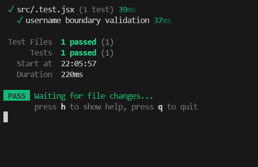

For this task, since it was quite vague, I will be using a simple react input field to test boundary logic validation.

So I created an Input field for username 
It accepts username that is 3 to 20 characters long 
it only accepts letters and numbers.

To run the test run the command npm run test and for normal manual testing simply run the program and type in inputs.

